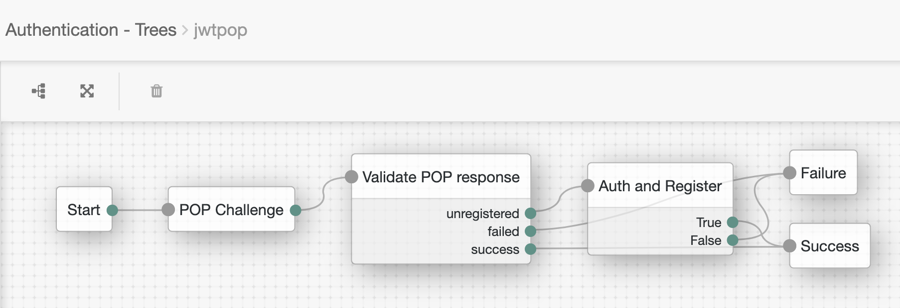
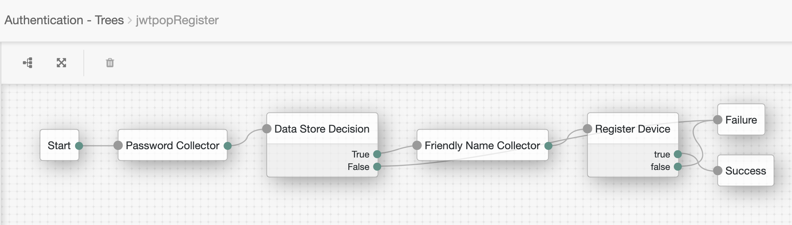

# jwtpop
JWT based proof of possession for mobile devices

This is a demonstration set of assets for secure binding of a mobile device to a user identity, implemented using the ForgeRock identity stack.

The demo uses JWT based challenge response authentication. The device presents a signed challenge to the access management service, using a registered key which is strongly protected within the device. The exact protection mechanism for the device key is implementation specific: it could for example be secured by a biometric check to support multi factor authentication.

If the device key is already registered to the user's identity, then authentication is complete and the user is given access. If the device key is not known, then the user can be authenticated using as many available factors as required: once this authentication process is complete, the device key is registered for subsequent logins.

The core functions are provided by a set of authentication nodes for the ForgeRock Access Management service. These nodes are implemented as Scripted Decision Nodes for convenience; for production purposes, authentication nodes should be implemented as native Java classes.

ForgeRock Identity Management is used in the demo for device registration. This provides a hook for ongoing device management via administrative functions or self service, as well as allowing device lifecycle workflows (e.g. user notification for new devices etc).

The requirement for Identity Management may be circumvented by customising the registration node to write directly to DS rather than call out to IDM.

Note that these assets are purely for demonstrating the concept of JWT based proof of possession, and have a number of limitations, including

- Limited/zero error handling
- Support for RSA signing only (no EC support)
- Plenty more limitations

## Contents

This repo consists of the following assets

- [Sample scripted decision nodes](nodes) for ForgeRock Access Manager 
- [Sample LDIF files](ldif) with the LDAP container definition for holding the device key information in a user directory 
- [Sample configuration files](idm) for ForgeRock IDM to handle device registration
- [Sample Postman collection and environment](postman) to emulate the mobile device for testing

## Requirements

You'll need the following to implement the full demo setup

- [ForgeRock Access Management](https://www.forgerock.com/platform/access-management) (tested with AM 6.5.2)
- [ForgeRock Directory Services](https://www.forgerock.com/platform/directory-services) (tested with DS 6.5.2)
- [ForgeRock Identity Management](https://www.forgerock.com/platform/identity-management) (tested with IDM 6.5.0)
- [Postman](https://www.getpostman.com) (tested with Postman 7.12)

## Overview of registration and authentication process

The demo setup follows [this sample flow](https://sequencediagram.org/index.html#initialData=C4S2BsFMAIAUCcD2iBm1XQA6IM48niIgHYBQpmAhvKAMYhXHDQCyiARiFBdXQ5U2gBBFjxoh6jZgBEAyuTacoAWgB8IgFywA8rIAq0APSUArsAAWkJhMrBIpRV0gAeZZoAsABgCM0ABLAwJgAwpTg4OyUtADWpMSIdtBQKMwYmtAA6lluZpbWtLaQGtDOtOZhUMQA5pCqDhxOao5QxbIgVcTQ8ATYxPjQAFYA7swAFMDw7TXw0JyIALaQExIAlPVKkGqaOvpGphZWdIVxCTCTVeapaM1FwrmIkwBetkTExc7dOL39w8B1IlsWMUAGqQSYoACe0Hw4DQOHaxEgABNBiNoAAdYgAUQAHhMoswTPgZgIUUjIAA3CQwcnAShcHCkAGqOTFADiSy6kCqIBwdm6ZMp1Jw0BQD2gRLBTJYrlZ0AAStzefzkdByVTaARpYDisFLDFoAApDIGCk4AB0XJ5fLBqvVwtIYWY9s10HizDFJmISPWTlcmgAqsToPs8kdQCRoAVwpEYoybjroEGwSHcocbBGyMyAJLSIEKpU2mYu+y5lhqOVCJGCjUwYCICXBvkPexWH03f1AvCIPSIaJWchAA) for registration and authentication. The following is a detailed breakdown of this sequence:


## Setup

### Access Management

#### Realm

It is recommended that you set up a separate realm for testing the assets. 

#### Secrets

You'll need to set up a secret with ID "IDMPassword" for the registration script. This should be the password for the IDM user "openidm-admin" (change this in the registration node if necessary).

#### Authentication nodes

You'll need to add all four groovy scripts as [scripted decision nodes](https://backstage.forgerock.com/docs/am/6.5/authentication-guide/#auth-node-scripted-decision). Once done, you can build an authentication tree to handle authentication and registration. For simplicity, you can split the registration into an inner tree - for example:

##### Authentication tree


##### Registration tree


## Directory Services

You'll need to update the ForgeRock DS schema with the custom user attribute *popDeviceProfiles*. This is a multivalued attribute for holding the registered devices. For each device, we store the following attributes as a JSON string:

- Device ID (a UUID generated by the device)
- Friendly name (chosen by the user at registration)
- Status (default "active") - not used in this demo
- Registered at (time and date when registered in epoch format)
- Last used (time and date when last used to authenticate) - not used in this demo
- JWK (public key provided by the device)

Example entry as follows

```
{"deviceId":"4d5d7dc2-6ee9-4ddd-85d0-79be72450c0c","friendlyName":"My iPad","lastUsed":"1577873454","registered":"1577873454","status":"active","jwk":"{\"kty\":\"RSA\",\"e\":\"AQAB\",\"kid\":\"b26f5b82-6d3d-492a-be07-c0f999477906\",\"n\":\"xFgwai0E1I98e4B2cYyxje77uegjCYVECrf86YjTR5uVSz5fog-iX1UMktE3eugaW-Q1czKb3sJh-H0yjd_DZf0YZVdg4qv5f97RO3_bmmjHnyNYJRFrJlHz-SIOJD7yjVRO8KfM9c7is4GoAAny_0PXN0RGIY4iKU5bGMYsZLXtdfGsFSX2srR9_OVmZaLxqjQiu4HnnxOG4bZGqpZKQjV1JMpvR70g67p5sKdAk-8PGitO0mifqSh69YVuNhsfBC3AK0vctkVDYRXO-1jBEAmtlYd_zWDWpBXR648VyviMYMOz8HaZ3oZNnkpuSaPbQb5-CMFkZCUbj0TCjF5fCw\"}","_id":"12a006b7-8393-420e-8585-41d4b8baf29b","_rev":"5"}
```

This repo includes a sample LDIF file with the required definition for this container (ldif/popDeviceProfilesSchema). You can import this by dropping it into the DS schema directory, or by using ldapmodify in a similar way that is [documented](https://backstage.forgerock.com/docs/am/6.5/install-guide/#install-prepare-opendj-external-identity-store) for importing the webauthn schema definition:

```
$ ./ldapmodify \
--hostname 'id.example.com' \
--port 1389 \
--useStartTLS \
--trustAll \
--continueOnError \
--bindDN 'cn=Directory Manager' \
--bindPassword 'str0ngEx4mplePa55word' \
popDeviceProfilesSchema.ldif 
```

## Identity Management

To make use of the registration logic, you'll need to do some work in IDM. 

### Managed device object

You'll need to add a managed object **device** with the following properties

- deviceID
- friendlyName
- lastUsed
- registered
- status
- jwk
- owner

All properties are of type string, except **owner**, which is a two way relationship with **user**. The full definition is included in the sample **managed.json** provided in the IDM directory of this repo.

## AM user store mapping

You'll need to create a mapping from the IDM managed user object to the Access Management user store, in order for new devices to be pushed to the user directory upon registration. This is a fairly simple one to one mapping, except for the mapping from devices to the popDeviceProfiles attribute(s) in DS. A sample mapping is provided in the sample **sync.json** provided in the IDM directory of this repo. This includes the required triggers to update user entries when updating registered devices (i.e. the *notify* and *notifySelf* definitions.


 # Testing
 
Ultimately, the authentication logic should be tested using a mobile app with the client side logic to generate signed responses to the HttpCallback response from AM. 
 
In the first instance, this repo includes a sample Postman collection for testing each stage of authentication and registration. The Postman requests included are as follows:

## Init crypto

This sets up an internal signing service, based on the open source [jsrsasign](https://github.com/kjur/jsrsasign) javascript library.

## Start authentication

This calls the AM authentication tree you set up above, and expects a 401 response with the challenge from AM.

## Challenge response

This creates and sends a signed JWT with the challenge from AM, along with the device and user details. 

If the device is registered and the JWT signature is validated, then AM will create a user session and return the ssoToken.

If the device is not registered, then AM will return a callback for authentication (in the case of the demo, this is just the directory password for the user specified in the signed JWT from the device), in order to start the device registration process. Tests then continue with the next request (**Register - password**)

## Register - password

This step sends the user's password back to AM in response to the password callback request If the password is successfully validated, AM will send back a NameCallback for the device friendly name to be used for device registration.

## Register - friendly name

This step sends the device friendly name to AM. In response to this request, AM will call out to IDM to register the device against the user's idenity. IDM will then immediately update the user entry in DS via implicit sync, including a new popDeviceProfiles entry with the new device details.

